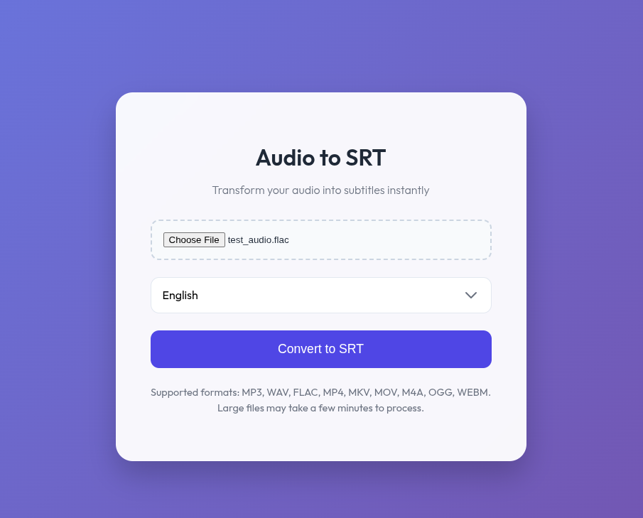

# Audio2SRT



A modern web application that converts audio and video files into SRT subtitles using OpenAI's Whisper model.

## Features

-   **High-Quality Transcription**: Uses OpenAI's Whisper model ("base") for accurate speech-to-text conversion.
-   **Modern UI**: A stunning, responsive interface with glassmorphism design.
-   **File Validation**: Robust client-side and server-side validation to ensure only supported files are processed.
-   **Loading Feedback**: Visual indicators during the transcription process.
-   **Multi-Language Support**: Supports transcription in multiple languages (English, Spanish, French, German, etc.).

## Supported Formats

-   Audio: `mp3`, `wav`, `flac`, `m4a`, `ogg`
-   Video: `mp4`, `mkv`, `mov`, `webm`

## Prerequisites

-   **Docker** (Recommended)
    OR
-   **Python 3.9+**
-   **FFmpeg** (Required for audio processing)

## Installation & Usage

### Option 1: Using Docker (Recommended)

1.  **Build the Docker image:**
    ```bash
    docker build -t audio2srt .
    ```

2.  **Run the container:**
    ```bash
    docker run -p 8080:8080 audio2srt
    ```

3.  **Access the application:**
    Open your browser and navigate to `http://localhost:8080`.

### Option 2: Running Locally

1.  **Install FFmpeg:**
    -   **Ubuntu/Debian**: `sudo apt install ffmpeg`
    -   **macOS**: `brew install ffmpeg`
    -   **Windows**: Download and add to PATH.

2.  **Install Python dependencies:**
    ```bash
    pip install -r requirements.txt
    ```

3.  **Run the application:**
    ```bash
    python app.py
    ```

4.  **Access the application:**
    Open your browser and navigate to `http://localhost:8080`.

## How it Works

1.  **Upload**: Select an audio or video file from your device.
2.  **Transcribe**: Click the "Convert to SRT" button. The file is securely uploaded and processed using the Whisper model.
3.  **Download**: Once transcription is complete, the `.srt` file is automatically downloaded to your device.

## Acknowledgments

This project was inspired by [transcribe_with_whisper](https://github.com/Tonkyboy/transcribe_with_whisper).
